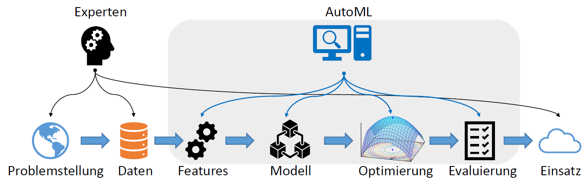
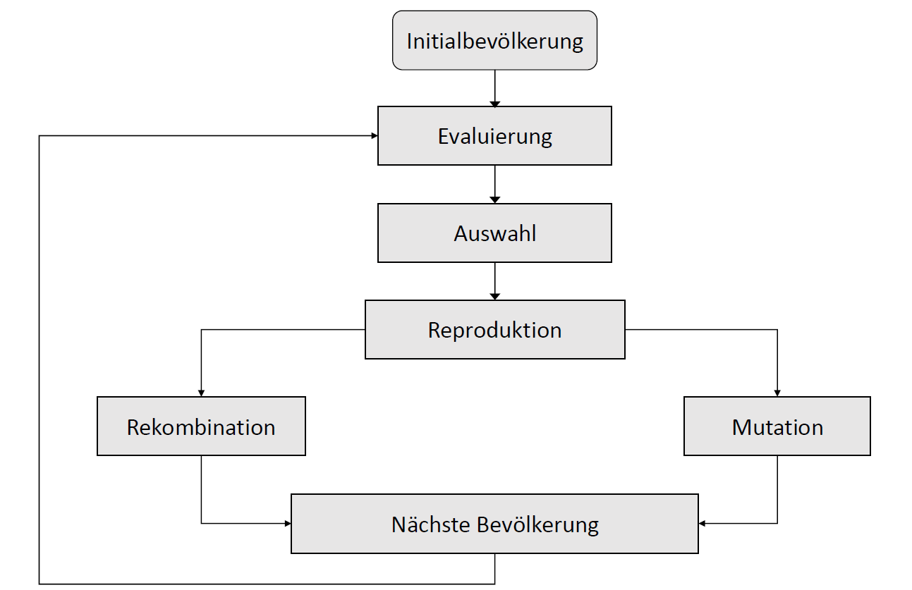
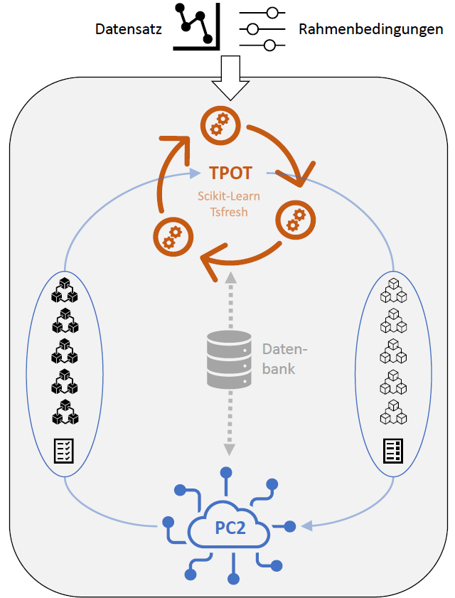
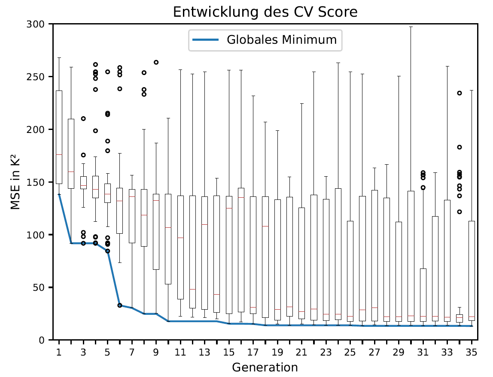
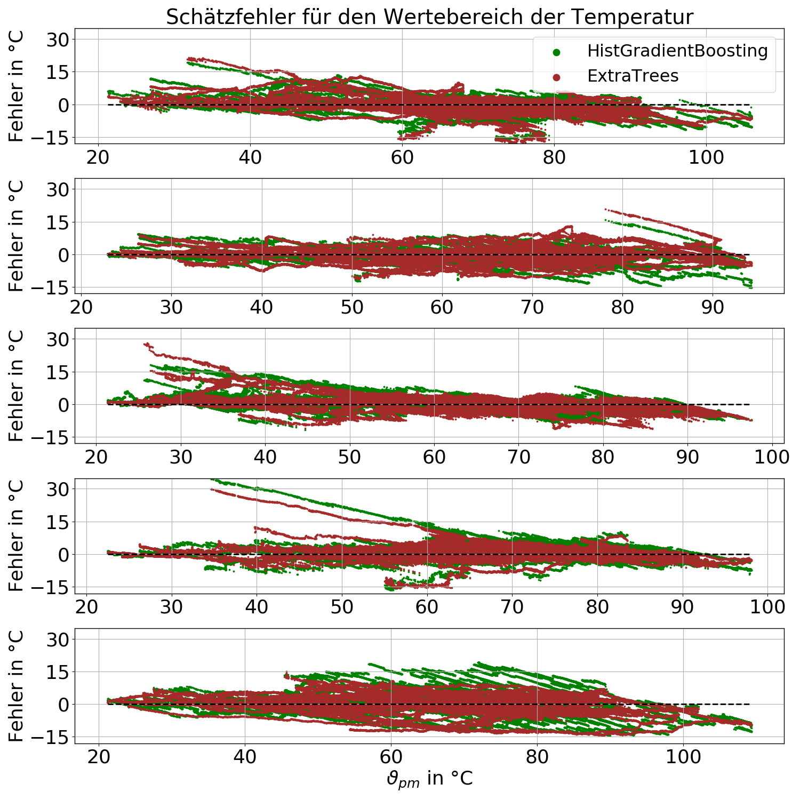
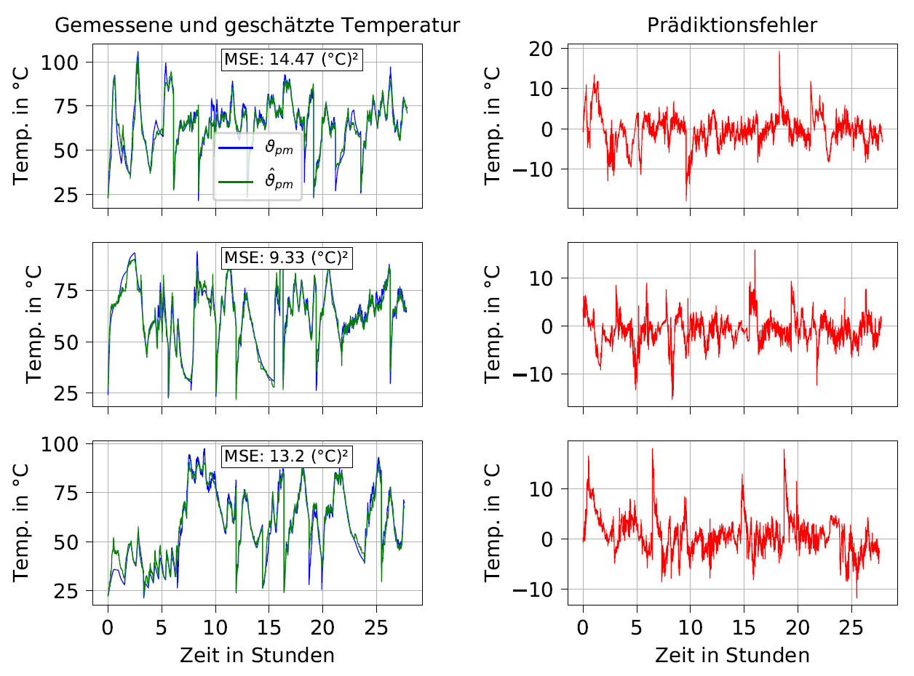

# Temperature Estimation of Electric Motors using Automated Machine Learning (AutoML)
In this work an approach to Automated Machine Learning was investigated. The goal was to implement and empirically evaluate a framework for the autonomous generation and optimization of ML pipelines in order to accurately estimate different component temperatures of a permanent magnet synchronous motor (permanent magnet, yoke, teeth, winding) using measurements for related quantities such as motor speed, voltages, currents, torque, as well as coolant and ambient temperatures. This repo mainly serves as a summary of the conducted work. Documentation was carried out in German. 

## AutoML: Make ML Available for Non-ML Experts

Pipeline design requires expert knowledge and can take up much time. This can be replaced by automated pipeline optimization which intelligently explores a multitude of possible design choices.

## Optimization Through Genetic Programming

A genetic programming approach ([TPOT](https://epistasislab.github.io/tpot/)) was chosen to implement the pipeline optimization. Inspired by concepts of biological evolution, individuals of populations are repeatedly evaluated and selected for reproduction. By controlling the selection criteria and core parameters such as mutation and recombination rates, exploitation and exploration of subspaces within the search space can be traded off. 

## Tsfresh: Give the framework the capability to come up with high performing pipelines

In order to implement a powerful as well as highly flexible framework, it was further extended by [Tsfresh](https://github.com/blue-yonder/tsfresh/). By integrating a wide array of time series feature extraction methods, the available search space was scaled up and autonomous feature engineering possibilities were improved. 

## Implemented Framework 

The implemented framework considers common regression models as provided by the [scikit-learn](https://scikit-learn.org/) library. The experiments were conducted using the HPC infrastructure of the [Paderborn Center for Parallel Computing](https://pc2.uni-paderborn.de/) in order to accelerate the autonomous pipeline optimization, as this enabled parallelization of pipeline evaluations. Furthermore, an SQL database was set up to store intermediate results and to handle information flow. 

## Example Results of an Optimization Process 

Each generation represents one population of 50 individuals (pipelines). One experiment took 200h on average to finish. In total, one experiment per motor component and two further experiments were conducted, totaling in 1200h or 50 days of autonomous search. 

## Error Residuals Scatter Plot for Two Top-Performing Pipelines

Estimation errors (especially underestimation) of high temperatures are critical. A proposed solution is using more measurement data for higher temperature ranges, possibly neglecting lower temperature ranges completely. Another approach could be to further increase penalties for errors at higher temperatures.  

## Example Estimations for the Permanent Magnet Temperature on Test Data  

Dataset collection was conducted prior to this work. In total, 140 hours of sensor data was recorded for various driving cycles.  
